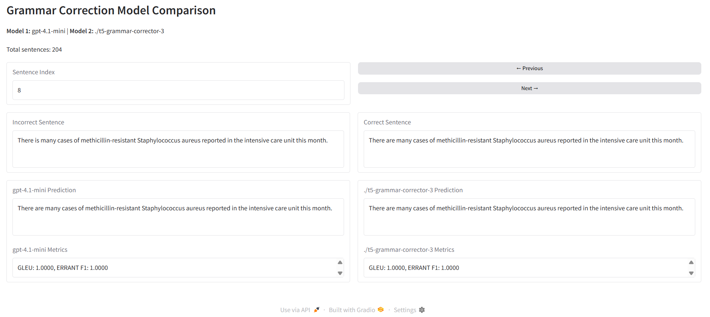

# ✏️ Grammatical Error Correction (GEC)

This project focuses on building an **Automatic Grammatical Error Correction (GEC)** system for English medical texts.

It involves comparing two approaches:
1. An out-of-the-box LLM (e.g., ChatGPT or Claude) using prompt engineering techniques.
2. A smaller fine-tuned model (e.g., T5-small from Google).

The specific instructions for the challenge are available in the [Challenge.md](Challenge.md) (in Spanish).

## Table of Contents
- [⚙️ Installation & Usage](#installation--usage)
- [🧩 Project Structure](#project-structure)
- [📝 Challenge Results Analysis](#challenge-results-analysis)
- [📌 Conclusion](#conclusion)
- [🧑‍💻 Author](#author)

## Installation & Usage
Clone the repository:
```bash
git clone https://github.com/eduquintanillae/grammar-correction.git
cd grammar-correction
```

Create virtual environment and install dependencies:
```bash
python -m venv venv

venv\Scripts\activate  # On Windows
source venv/bin/activate  # On macOS/Linux

pip install -r requirements.txt
```

Make sure to also download the necessary spaCy model for evaluation:
```bash
python -m spacy download en_core_web_sm
```

Set up .env file for API keys (e.g., OpenAI):
```bash
OPENAI_API_KEY=your_openai_api_key
```

Inicialize the fastapi app:
```bash
uvicorn main:app --reload
```

Make a request to the endpoint:
```bash
url = http://127.0.0.1:8000/correct_grammar
json_body = {
    "text": "I going to the hospital right away!",
    "model": "gpt-4.1-mini"
}
response = requests.post(url, json=json_body)
print(response.json())
```

## Project Structure
This project is structured into several modules:

- **eda**: Exploratory Data Analysis scripts.
- **train**: Contains the training logic and model fine-tuning.
- **evaluate**: Handles model evaluation, metric computation and result analysis.
- **modules**: Contains the core modules for grammar correction.

Within the `modules` directory, the key components are:
- `gec.py`: The main class for grammar correction. It orchestrates the use of LLMs and fine-tuned models.
- `llm.py`: Manages interactions with Large Language Models (LLMs) like GPT-4.1-mini and T5-small.
- `evaluator.py`: Contains functions to evaluate model performance using various metrics.

Additionally, the `evaluate/gradio_interface.py` file provides a user-friendly Gradio interface to compare predictions from different models. Simply edit the data paths in the script to point to your local csv results and run the file to launch the interface. Access it with `http://127.0.0.1:7860/`



## Challenge Results Analysis
In this section, I present the results from the grammatical error correction challenge, including model comparisons, difficulties encountered, and proposals for improvement.

### Model comparison (LLM vs Fine-tuned model)
For this task, I used two models:
1. **LLM**: GPT-4.1-mini (via API)
2. **Fine-tuned model**: T5-small (fine-tuned on the W&I+LOCNESS corpus)

While gpt-4.1-mini is a powerful model, the fine-tuned T5-small demonstrated competitive performance, particularly in terms of grammatical accuracy and fluency. However, there were instances where GPT-4.1-mini produced superior results, especially in handling complex sentence structures.

Finetuned T5-small often failed to correct article usage, but excelled in verb tense.
Gpt-4.1-mini was good at correcting prepositions ("in" vs "on") but often missed tense changes (has been taking vs is taking).

With overall scores of:
- **GPT-4.1-mini**: Mean Errant F1 Score: 0.135, GLEU: 0.747
- **T5-small**: Mean Errant F1 Score: 0.156, GLEU: 0.801

Additionally to the quality of the results, I also measured the time it took for each model to make predictions on the medical subset. The results were as follows:
| Model          | Average Time per Text       |
|----------------|-----------------------------|
| GPT-4.1-mini   | 0.822 seconds               |
| T5-small       | 1.454 seconds               |

Resulting in a speedup of **1.77x** when using GPT-4.1-mini over T5-small.
This could be due to the overhead of encoding and decoding with the T5 tokenizer, as well as the hardware differences (available gpu vs API calls).

### Difficulties correcting grammar errors
While both models showed proficiency in correcting common grammatical errors, they struggled with:
- Beginning of sentence article corrections (e.g., "The patient", "A doctor").
- Complex medical terminology confusing the models and leading to missed error corrections.
- Multiple simultaneous errors in a single sentence. (e.g. "He is taking... " -> "He has been taking...")

### Proposals for improvement
- **Data Augmentation**: Introduce more diverse and complex medical sentences in the training data to help models learn a wider range of error patterns.
- **Error-specific Training**: Focus on specific error types that models struggle with, such as article usage and complex sentence structures.
- **Feedback Loop**: Implement a feedback mechanism where corrected sentences are reviewed and used to further fine-tune the models.

### Identify corpus characteristics
The W&I+LOCNESS corpus contains a variety of grammatical errors typical in medical texts, including:
- Article misuse (e.g., "a" vs. "the")
- Subject-verb agreement errors
- Preposition errors

The medical subset specifically includes terminology and phrases common in healthcare settings, which can introduce unique challenges for grammatical correction. And included grammatical errors such as:
- Article omision
- Verb tense errors
- Preposition misuse
- Subject-verb agreement errors

### Preprocessing techniques
To prepare the data for training and evaluation, I needed to apply several preprocessing steps:
- **Transform from M2 format to plain text**: The original corpus is in M2 format, which includes annotations for errors. I converted this to plain text for model training and evaluation.
- **Added prefix**: For the T5 model, I added a "grammar:" prefix to each input sentence to guide the model's task.
- **Tokenization**: Used the T5 tokenizer to ensure consistency with the model's expected input format.
- **Padding and truncation**: Ensured that all input sequences were of uniform length for batch processing.

### Metrics used for evaluation
For evaluating the models, I used:
- **GLEU**: A metric that evaluates the fluency and grammaticality of the corrected sentences.
- **Errant**: A tool that provides precision, recall, and F1 scores based on the types of grammatical errors corrected.

These metrics provide a comprehensive view of the models' performance in correcting grammatical errors and widely accepted in the GEC community (both used on the [BEA shared tasks](https://www.cl.cam.ac.uk/research/nl/bea2019st/) *see Metric Justification section).

### Prediction examples
Here are some examples of sentences before and after correction by both models:
| Incorrect Sentence                          | Correct Sentence                           | GPT-4.1-mini Prediction                   | T5-small Prediction                        | Correct Model
|---------------------------------------------|--------------------------------------------|--------------------------------------------|--------------------------------------------|--------------
| He complained **from** retrosternal chest pain radiating to the left shoulder and associated with diaphoresis. | He complained **of** retrosternal chest pain radiating to the left shoulder and associated with diaphoresis. | He complained **of** retrosternal chest pain radiating to the left shoulder and associated with diaphoresis. | He complained **from** retrosternal chest pain radiating to the left shoulder and associated with diaphoresis. | GPT-4.1-mini
| The registered nurse **give** the intramuscular injection of vitamin B12 cyanocobalamin in the deltoid muscle. | The registered nurse **gave** the intramuscular injection of vitamin B12 cyanocobalamin in the deltoid muscle. | The registered nurse **gives** the intramuscular injection of vitamin B12 (cyanocobalamin) in the deltoid muscle. | The registered nurse **gave** the intramuscular injection of vitamin B12 cyanocobalamin in the deltoid muscle. | T5-small
| The patient **have** pyrexia of 39.2 degrees Celsius accompanied by rigors and profuse diaphoresis. | The patient **has** pyrexia of 39.2 degrees Celsius accompanied by rigors and profuse diaphoresis. | The patient **has** pyrexia of 39.2 degrees Celsius accompanied by rigors and profuse diaphoresis. | The patient **has** pyrexia of 39.2 degrees Celsius accompanied by rigors and profuse diaphoresis. | Both
| **Patient** is experiencing severe cephalgia accompanied by photophobia and phonophobia consistent with migraine headache. | **The patient** is experiencing severe cephalgia accompanied by photophobia and phonophobia consistent with migraine headache. | **Patient** is experiencing severe cephalgia accompanied by photophobia and phonophobia, consistent with a migraine headache. | **Patient** is experiencing severe cephalgia accompanied by photophobia and phonophobia consistent with migraine headaches. | None

## Conclusion
It was an interesting challenge to work on grammatical error correction in medical texts. The comparison between a powerful LLM and a smaller fine-tuned model provided valuable insights into the strengths and limitations of each approach.

Both models demonstrated the ability to correct common grammatical errors, but there is still room for improvement, especially in handling complex sentences and specific error types.

### Next Steps
- Test bigger models like GPT-4 or Claude 3 if budget allows.
- Further fine-tuning of the T5 model with a focus on specific error types.
- Experimenting with larger models or longer fine-tuning on more extensive datasets.
- Grid search for hyperparameter optimization during fine-tuning.
- Dataset preprocessing improvements, such as text normalization and augmentation.
- Add more evaluation metrics (e.g., M2, BLEU).

Code improvements:
- Unit tests for each module.
- Parameterize the LLM hyperparameters to adjust training.

## Author
Created by [Eduardo Quintanilla](https://github.com/eduquintanillae) - feel free to reach out for any questions or suggestions.